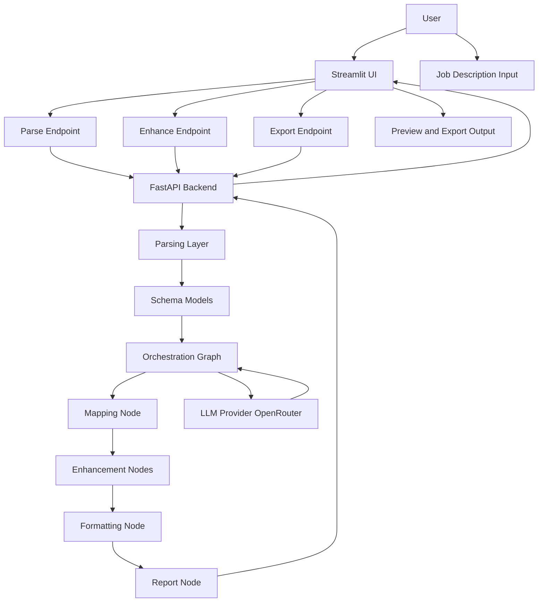

[](https://github.com/AliTechM/ai-profile-personalization-engine/releases)


[](https://openrouter.ai)


# AI Profile Personalization Engine

<p align="center">
  
</p>

<p align="center">
  <b>Full-stack AI MVP</b> that matches a CV to a job description and generates an ATS-friendly, role-aligned resume using structured LLM reasoning — with <b>explainable</b> and <b>hallucination-aware</b> improvements.
</p>

<p align="center">
  <a href="#local-setup">Run locally</a> •
  <a href="#demo-preview">Screenshots</a> •
  <a href="#architecture-overview">Architecture</a> •
  <a href="#ai-workflow">AI Workflow</a>
</p>

The system analyzes a candidate’s CV against a job description and generates a personalized, role-aligned resume using structured LLM reasoning.

---

## Use Case

Designed for job seekers who want data-driven resume personalization instead of manual rewriting, helping produce clearer, role-aligned, and ATS-friendly resumes.

---

## Key Features

- FastAPI backend with modular API architecture
- Structured CV ↔ Job matching pipeline
- LLM-based resume and job description analysis
- Explainable AI enhancement (no fabricated experience)
- Skill match and gap analysis
- PDF & DOCX export support
- Streamlit prototype UI used for rapid validation before migration to a production Next.js frontend

---

## MVP Scope

This project represents a functional MVP built to validate an AI-driven resume personalization workflow.

Focus of this version:
- validating structured LLM reasoning pipelines
- testing real user interaction flows
- proving feasibility before production-scale architecture

---

## My Contribution

This repository represents my **personal implementation and extension** of a collaborative AI training project.

Primary contributions:

- Building the AI orchestration workflow
- Prompt engineering and enhancement logic
- Structuring data schemas using Pydantic models
- Implementing frontend interaction flows for AI evaluation
- Preparing the system architecture for real-world integration

---

## Demo Preview

<p align="center">
  
  
</p>

<p align="center">
  
  
</p>

<p align="center">
  
</p>

---

## Problem Statement

Many junior and mid-level candidates struggle to tailor their resumes for specific roles.  
They often rely on guesswork and spend significant time rewriting CVs without understanding recruiter or ATS expectations.

---

## Solution Overview

Upload CV + Job Description  
→ Structured Analysis  
→ AI Alignment & Enhancement  
→ Transparent Improvement Report  
→ Export optimized resume

---
## Engineering Challenges Solved

- Ensuring factual resume enhancement without hallucinated experience
- Converting unstructured CV text into reliable structured schemas
- Maintaining alignment between job requirements and generated output
- Designing explainable AI outputs instead of black-box rewriting

---

## Architecture Overview

**Pipeline**

Structure → Reason → Rewrite → Review → Render

## Live Architecture Diagram

## Live Architecture Diagram



### Backend (FastAPI)

- Resume & job parsing endpoints
- Enhancement and mapping workflows
- Export services (PDF/DOCX)
- LangChain / LangGraph orchestration

### Frontend (Prototype UI)

Streamlit-based interface used for workflow validation and user interaction testing.

---

## Frontend Implementation

The frontend layer was designed and implemented as part of the MVP to simulate real user interaction with the AI system.

Key aspects:

- User-driven CV and job description workflow
- Real-time enhancement feedback
- Structured result visualization
- UX focused on clarity and explainability of AI changes

> Streamlit was intentionally used for rapid product validation before migrating to a production-grade Next.js interface.

---

### Shared Models

Pydantic schemas define a unified contract for:

- Resume
- Experience
- Skills
- Education
- Certifications
- JobDescription
- MappingResult

---

## AI Workflow

### Parsing Flow
Upload → Text Extraction → Structured Schemas

### Enhancement Flow
Mapping → Score Evaluation → Enhancement → Formatting → Report Generation

---

## Tech Stack

- Python
- FastAPI
- Streamlit
- LangChain / LangGraph
- Pydantic
- LLM APIs (OpenAI / Gemini)
- REST API Architecture

---

## Enhancement Modes

| Mode | Description |
|------|-------------|
| legacy | Full enhancement in a single response |
| incremental | Streamed enhancement with real-time updates |

---

## Local Setup

1. Clone Repository

```bash
git clone <repo-url>
cd ai-profile-personalization-engine
```

2. Backend Setup
python -m venv .venv
.venv\Scripts\activate
pip install -r requirements.txt

Create environment file:
copy app/env.example app/.env

Run backend:
cd app
uvicorn main:app --reload --host 0.0.0.0 --port 8000
http://localhost:8000/docs

3. Run Streamlit UI
cd cv_app_project
pip install -r requirements.txt
streamlit run app.py

Open:
http://localhost:8501

Future Improvements


Next.js production frontend
Authentication & user sessions
Deployment pipeline
Persistent user profiles
Advanced job-match scoring

Note

This project is intended as a demonstration of AI-assisted application architecture and responsible LLM usage, emphasizing transparency and factual correctness.

📄 License

Educational and portfolio use.
